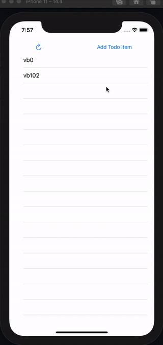

# Advanced Todo Application

This repo created for interview proccess so you should be learn how grow your project.

## Blog

[Advanced Swift TODO app to Interview](https://vbacik-10.medium.com/advanced-swift-todo-app-to-interview-77ddc754630d)

## Demo

## Content

- Network Layer
- Application Constnat
- Atomic Widget
- 3.parth Usage(Alamofire)
- Feature Folder Programming
- Protocol Programmin(Extension etc)
- Delegate Patter (Dependency Injection*)
- Unit Testing
- UI Testing

